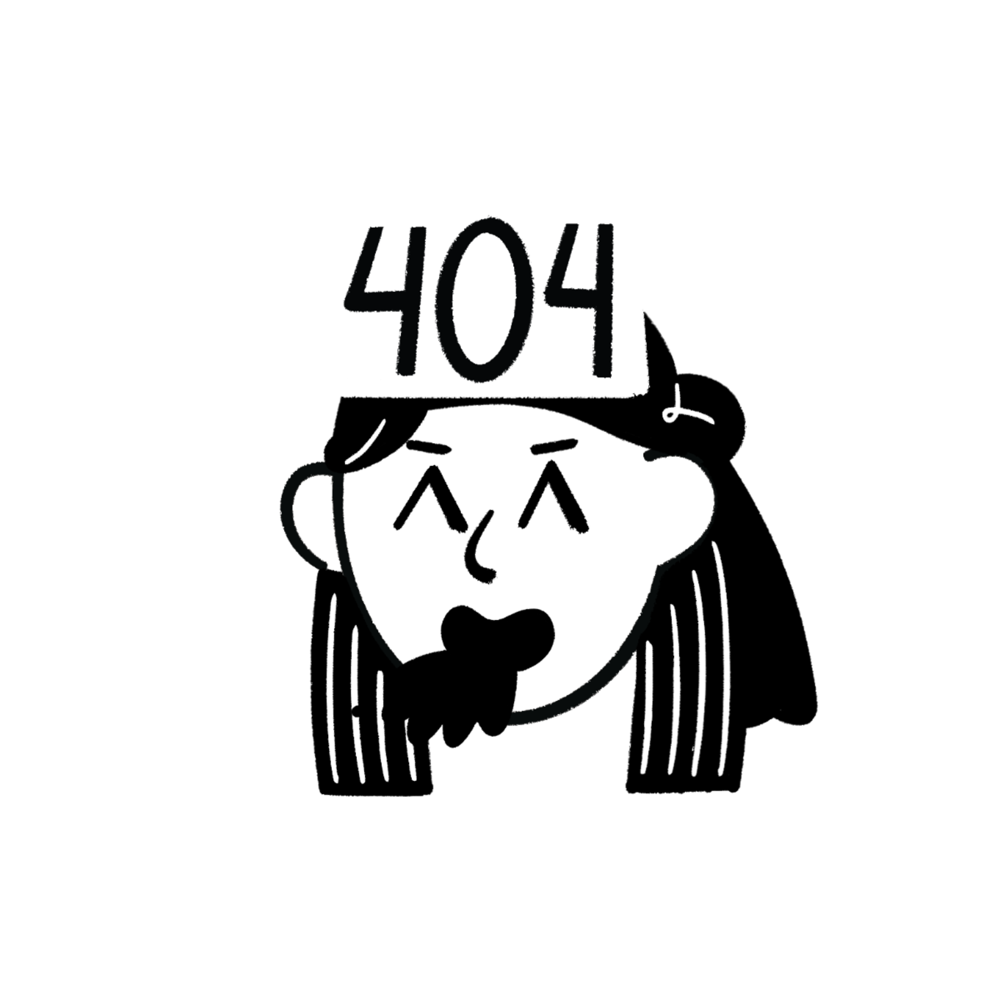

# 프로그래머스 AI 백엔드 데브코스 1기

## Day 02
### (실습) Frontend AI로 생성한 html git page에 배포
>  [개발자 소개 페이지](developer_intro/index.html)  
>   [복습 페이지](practice/day03/example.html) 

### (실습) CSS로 인라인 스타일 지정
🟥 [네모 상자 만들기](practice/day03/ex04/index.html)
